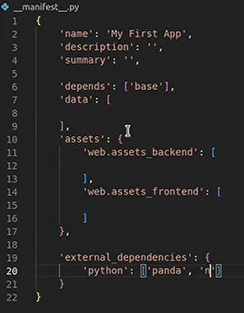

# Manifest file

The manifest file is the definistion of your module.

Inside this manifest, you load XML, CSS, JavaScript and other stuff like this.

One of the most important keys is the Depends, because the Depends tells if I install this module, those other modules need to be installed.

When you have no real dependency, you can just add the base module, the one we already installed in previous section.

What's important to understand is that any module that's in your depends will be installed when you install your module.

The data key is the files that we want to load, report, security, templates and views that are inside this key.

The assets key is divided in other subkeys, so there is the web.assets backend, that's the backend assets, web.assets frontend,that are the front-end assets.

There is also the web.assets_common that are common for both backend and front-end.

Actually there are other keys like point of sale assets, test assets, but we won't use them here.

Most of the time in the assets you will load JavaScript, CSS or SCSS and XML files that are used for your JavaScript.

You also have a key that's external dependencies that can be used to define that you need things that are external to Odoo to exist on the machine.

