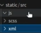

# Model Structure

For create an application, it needs at least a __manifest__.py and an __init__.py file.

So for the manifest.py we have to give a dictionary of key values. The most important one is the name that's the name of our module:
```py
__manifest__.py
{
    'name':'My First App',
    'description':'',
    'summary':'',
}
```
There are also a lot of different things that we can define in the manifest, but we'll talk about that in later sections.

Odoo being an MVC, we are going to add a models folder, a views folder, a controllers folder. Just so that it's not a mess when we code, we can also add a reports folder that will contain our reports, a templates folder that will contain all the frontend templates, while views are actually backend templates and we can static folder. Inside the static folder, you can add an src folder that will contain the JavaScript, the Css or SCSS, depending what you want to use and XML templates that are specific for the JavaScript modules. 



we can also add a security folder that will contain all the security for models. We will use all those folders later in the application.

